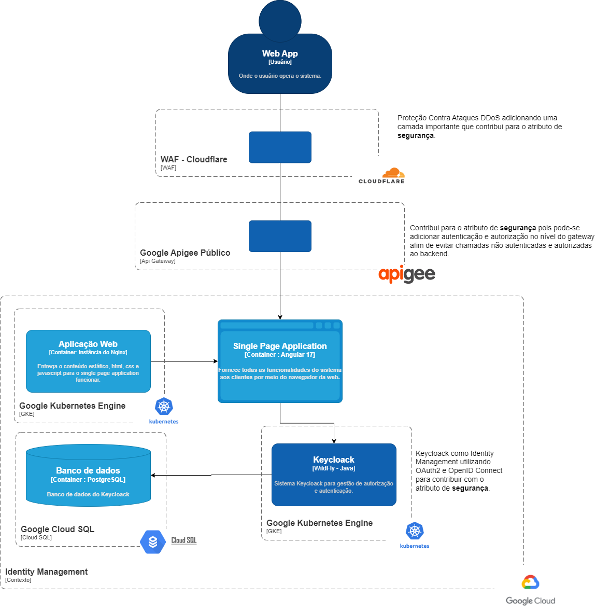
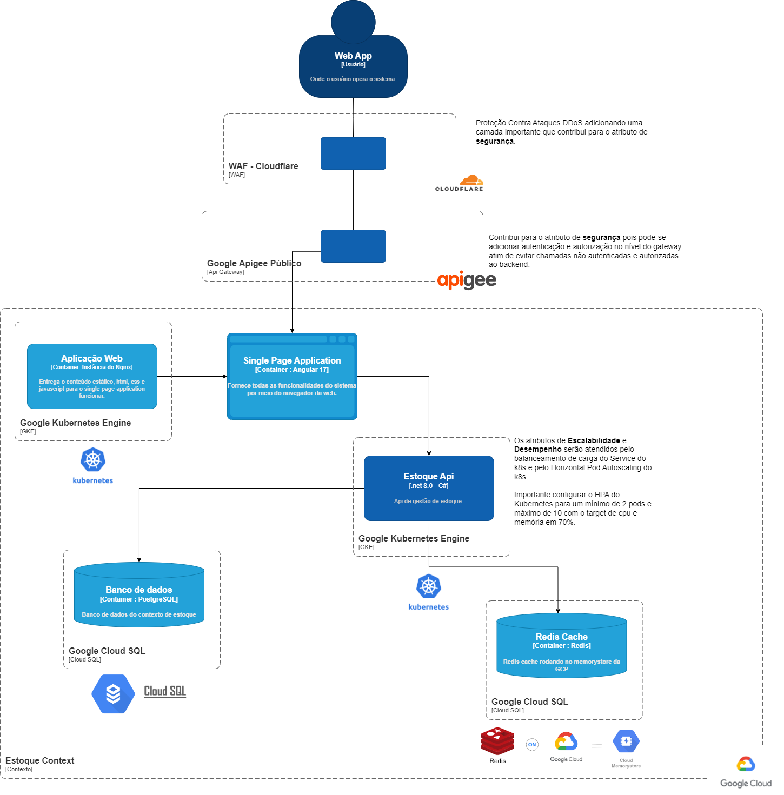

# Desenho da solução para Cloud

**Em uma eventual publicação em produção com um front end acessando a api de produtos, poderia-se adotar a solução cloud native com dois contextos, conforme desenhos a baixo:**

## Contexto Identity Management

Contexto necessário para atender requisitos de autenticação e autorização mínimos para uma aplicação exposta em produção. Esse contexto serve como single sign on para uma arquitetura de microserviços em que um único conjunto de credenciais irá servir como autenticador e autorizador para os múltiplos serviços expostos.

## Contexto Estoque

Contexto protegido por token JWT que é obtido pelo usuário no contexto de identity management antes de acessar os recursos deste contexto.

# Estoque App

Componentes e frameworks utilizados
- .Net 8.0
- EF Core
- Postgresql
- Redis
- Circuit breaker com Polly para trazer resiliência a operação da api mesmo quando a api de cotação estiver fora do ar.
- FluentValidation
- Docker e docker compose para subir a aplicação, o BD e o Redis
- Xunit para testes unitários 

Arquitetura em camadas aderente ao Clean Architecture e ao DDD
- Camada do presentation onde fica o web api
- Camada de aplicação
- Camada de domínio
- Camada de infra
- Camada de crosscutting
- Camada de testes

# Como subir o ambiente local
Basta dar um docker compose up que todos os componentes necessários e a api ficarão de pé.

